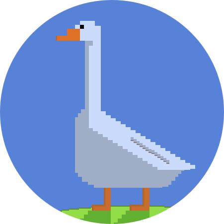

Goose
=========
[](https://github.com/nilenso/goose/actions/workflows/test_lint.yml)
[](https://clojars.org/com.nilenso/goose)
[](https://cljdoc.org/d/com.nilenso/goose)

The Next-Level background job processing library for Clojure.
> **Simple. Pluggable. Reliable. Extensible. Scalable.**

Performance
---------
Please refer to the [Benchmarking section](https://github.com/nilenso/goose/tree/main/perf).

Features
---------
- *Reliable* - Code/Hardware/Network failure won't cause data loss
- Native support for RabbitMQ & Redis
- Pluggable [Message Broker](https://github.com/nilenso/goose/wiki/Guide-to-Message-Broker-Integration) & [Metrics Backend](https://github.com/nilenso/goose/wiki/Guide-to-Custom-Metrics-Backend)
- [Scheduled Jobs](https://github.com/nilenso/goose/wiki/Scheduled-Jobs)
- [Batch Jobs](https://github.com/nilenso/goose/wiki/Batch-Jobs)
- [Periodic Jobs](https://github.com/nilenso/goose/wiki/Periodic-Jobs)
- [Error Handling & Retries](https://github.com/nilenso/goose/wiki/Error-Handling-&-Retries)
- Extensible using [Middlewares](https://github.com/nilenso/goose/wiki/Middlewares)
- Concurrency & Parallelism friendly
- ... more details in [Goose Wiki](https://github.com/nilenso/goose/wiki)

Getting Started
---------
[](https://clojars.org/com.nilenso/goose)

### Add Goose as a dependency
```Clojure
;;; Clojure CLI/deps.edn
com.nilenso/goose {:mvn/version "0.4.0"}

;;; Leiningen/Boot
[com.nilenso/goose "0.4.0"]
```

### Client
```Clojure
(ns my-app
  (:require
    [goose.brokers.rmq.broker :as rmq]
    [goose.client :as c]))

(defn my-fn
  [arg1 arg2]
  (println "my-fn called with" arg1 arg2))

(let [rmq-producer (rmq/new-producer rmq/default-opts)
      ;; Along with RabbitMQ, Goose supports Redis as well.
      client-opts (assoc c/default-opts :broker rmq-producer)]
  ;; Supply a fully-qualified function symbol for enqueuing.
  ;; Args to perform-async are variadic.
  (c/perform-async client-opts `my-fn "foo" :bar)
  (c/perform-in-sec client-opts 900 `my-fn "foo" :bar)
  ;; When shutting down client...
  (rmq/close rmq-producer))
```

### Worker
```Clojure
(ns my-worker
  (:require
    [goose.brokers.rmq.broker :as rmq]
    [goose.worker :as w]))

;;; 'my-app' namespace should be resolvable by worker.
(let [rmq-consumer (rmq/new-consumer rmq/default-opts)
      ;; Along with RabbitMQ, Goose supports Redis as well.
      worker-opts (assoc w/default-opts :broker rmq-consumer)
      worker (w/start worker-opts)]
  ;; When shutting down worker...
  (w/stop worker) ; Performs graceful shutsdown.
  (rmq/close rmq-consumer))
```
Refer to wiki for [Redis](https://github.com/nilenso/goose/wiki/Redis), [Periodic Jobs](https://github.com/nilenso/goose/wiki/Periodic-Jobs), [Error Handling](https://github.com/nilenso/goose/wiki/Error-Handling-&-Retries), [Monitoring](https://github.com/nilenso/goose/wiki/Monitoring-&-Alerting), [Production Readiness](https://github.com/nilenso/goose/wiki/Production-Readiness), etc.

Getting Help
---------
[](https://clojurians.slack.com/channels/goose)

Please [open an issue](https://github.com/nilenso/goose/issues/new) or ping us on [#goose @Clojurians slack](https://clojurians.slack.com/channels/goose).

Companies using Goose in Production
---------
<a href="https://aspect-analytics.com/">
  
</a>
<a href="https://beecastle.com/">
  
</a>

Contributing
---------
- As a first step, go through all the [architecture-decisions](https://github.com/nilenso/goose/tree/main/architecture-decisions)
- Discuss with maintainers on the [issues page](https://github.com/nilenso/goose/issues) or at [#goose @Clojurians slack](https://clojurians.slack.com/channels/goose)
- See [the contributing guide](https://github.com/nilenso/goose/blob/main/CONTRIBUTING.md) for setup & guidelines

Why the name "Goose"?
---------
<p align="center">
  
</p>

Named after [LT Nick 'Goose' Bradshaw](https://topgun.fandom.com/wiki/Nick_Bradshaw), the _sidekick_ to [Captain Pete 'Maverick' Mitchell](https://topgun.fandom.com/wiki/Pete_Mitchell) in Top Gun.

License
---------
[](./LICENSE)
